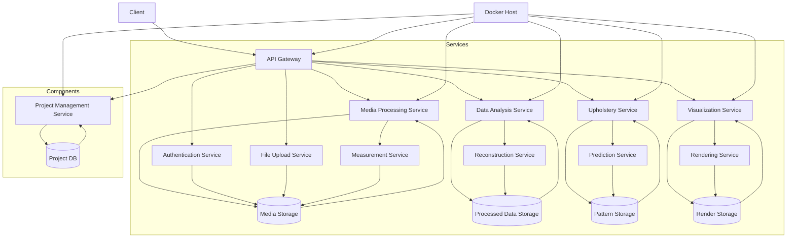

# StitchSketch: The Flexible CRM Platform for Upholstery Projects

## Description

StitchSketch is a versatile platform designed to streamline customer relationship management (CRM) and project management (PM). Built on PostgreSQL, it leverages photogrammetry, machine learning, and advanced media file processing techniques to provide actionable insights and visualizations for hobby projects and small business marketing material.

### Key Features
- **Enhanced Media Management:** Easily manage, process, and analyze image and media files.
- **Real-time Data Analysis:** Utilize computer vision and machine learning for precise measurements and estimates.
- **Actionable Visualizations:** Generate stunning 3D models and visualizations from media files.
- **User-Friendly Interface:** A intuitive interface for project management and data analytics.

## Architecture

Below is a simplified architecture diagram showcasing the key components of StitchSketch:



## Getting Started

To build and run the project, execute `docker-compose up --build` in your terminal. This command will set up a containerized environment for all necessary services.

```sh
docker-compose up --build
```

### Notes on Key Services:
- **Media Processing Service (C):** Handles image processing, photogrammetry, and machine learning.
- **Data Analysis Service (D):** Provides insights from processed media data.
- **Project Management Service (G):** Manages customer projects, tasks, and deadlines.

### Stuff That Works! :)
- [x] `docker-compose` actually builds the thing
- [x] creating jobs

### Stuff That Doesn't Work Yet :(
- [ ] IAM/login
- [ ] creating employees/users
- [ ] creating customers/clients
- [ ] photogrammetry service integration
- [ ] job status
- [ ] job subtasks
- [ ] media uploads
