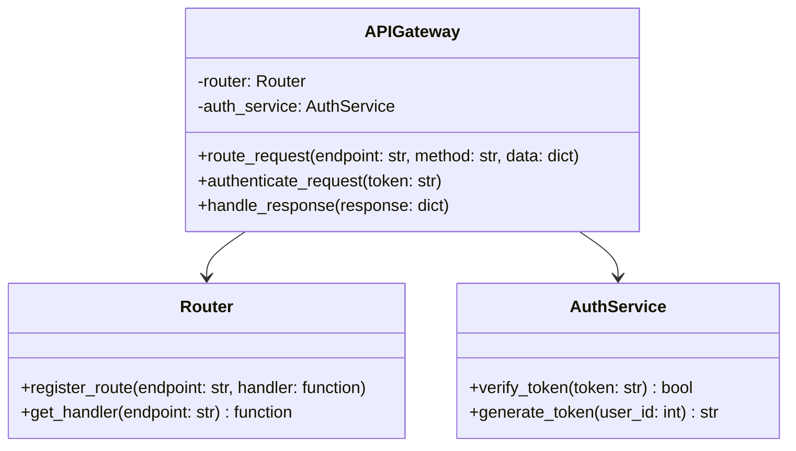

# API Gateway

## Overview

The API Gateway serves as the single entry point for all client requests in the StitchSketch system. It's responsible for routing requests to the appropriate microservices, handling authentication, and managing responses.

## Class Diagram

## Key Components

1. **APIGateway**: The main class that handles incoming requests.
2. **Router**: Manages the routing of requests to the appropriate service.
3. **AuthService**: Handles authentication and token management.

## How It Works

1. When a request comes in, the `APIGateway` first calls `authenticate_request()` to verify the user's token.
2. If authentication is successful, `route_request()` is called to determine which service should handle the request.
3. The request is forwarded to the appropriate service.
4. When the service responds, `handle_response()` is called to process and format the response before sending it back to the client.

## Technologies Used

- Flask: For creating the RESTful API
- Flask-RESTful: For easy resource routing
- Flask-CORS: For handling cross-origin requests
- JWT: For token-based authentication

## API Endpoints

- `/auth`: Handles user authentication
- `/images`: Routes to the Image Processing Service
- `/models`: Routes to the 3D Reconstruction Service
- `/upholstery`: Routes to the Upholstery Service
- `/visualize`: Routes to the Visualization Service
- `/users`: Routes to the User and Project Management Service

Each of these endpoints may have multiple HTTP methods (GET, POST, PUT, DELETE) depending on the specific operations required.
