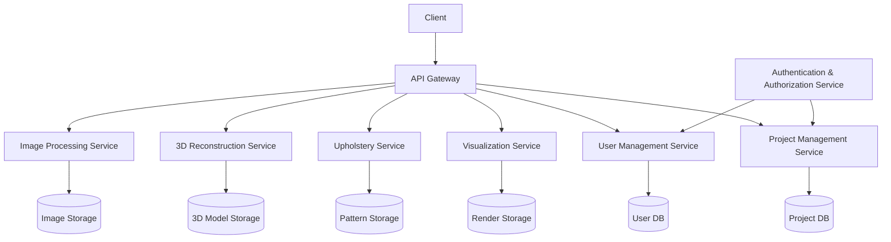

# StitchSketch Architecture

StitchSketch is an open-source photogrammetry solution designed specifically for upholstery shops. It aims to democratize access to 3D scanning by providing a cost-effective alternative to expensive laser-based 3D scanning systems.

## **Overview**

StitchSketch follows a microservices pattern, with each service responsible for a specific aspect of the photogrammetry and upholstery calculation process. The User Management and Project Management functionalities have been separated into distinct services for better scalability and maintainability.

### Diagram

### Key Components

1. [API Gateway](api_gateway.md): Serves as the entry point for all client requests.
2. [Image Processing Service](image_processing_service.md): Handles image ingestion and preprocessing.
3. [3D Reconstruction Service](reconstruction_service.md): Creates 3D models from processed images.
4. [Upholstery Service](upholstery_service.md): Manages pattern calculations and digital reupholstery prototyping.
5. [Visualization Service](visualization_service.md): Generates Gaussian Splat reconstructions and other visualizations.
6. **[User Management Service](user_management_service.md)**: Handles user accounts, authentication, and authorization.
7. **[Project Management Service](project_management_service.md)**: Tracks project metadata and manages project-specific data.
8. [Authentication & Authorization Service](authentication_authorization_service.md): Handles user authentication and authorization across services.

## Data Flow

1. The client uploads images through the API Gateway.
2. The Image Processing Service prepares the images for 3D reconstruction.
3. The 3D Reconstruction Service generates a 3D model from the processed images.
4. The Upholstery Service uses the 3D model to calculate patterns and create digital prototypes.
5. The Visualization Service generates various views and reconstructions of the 3D model.
6. The User Management Service handles user authentication, authorization, and account management.
7. The Project Management Service tracks project metadata and manages project-specific data.
8. The Authentication & Authorization Service ensures secure access to services based on user credentials.

## Technology Stack

- [ ] TODO: Tech Stack Discovery & Decisions

- Backend: *Python (varied API hosts for specialized Python microservices)*
- Frontend: *Web-based (Python preferred)*
- Databases:
  - User Management: *(NoSQL) MongoDB or similar*
  - Project Management: *(Relational) PostgreSQL or similar*
  - Image & Model Storage: *MinIO or similar object storage system*
- Authentication & Authorization: *JWT with OAuth/OpenID Connect for secure access management*

For detailed information on each service, please refer to the individual service documentation linked above.
