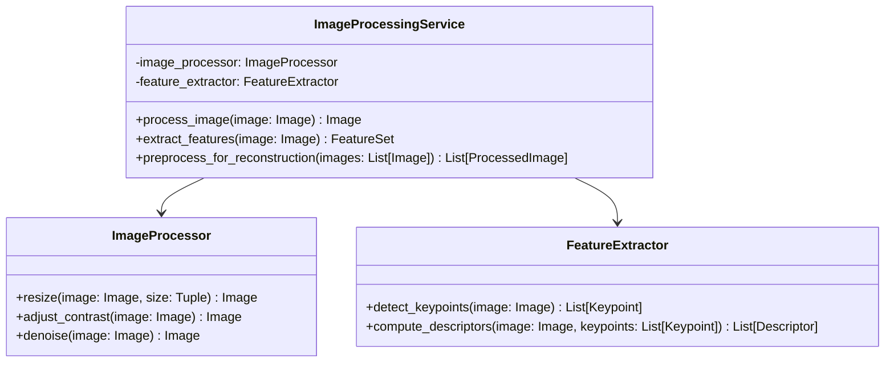

# Image Processing Service

## Overview

The Image Processing Service is responsible for preparing images for 3D reconstruction. It handles tasks such as image resizing, feature extraction, and preprocessing for optimal results in the reconstruction phase.

## Class Diagram

## Key Components

1. **ImageProcessingService**: The main class that coordinates image processing tasks.
2. **ImageProcessor**: Handles basic image processing operations.
3. **FeatureExtractor**: Extracts features from images for use in 3D reconstruction.

## How It Works

1. When images are uploaded, `process_image()` is called for each image to perform basic processing (resizing, contrast adjustment, denoising).
2. `extract_features()` is then called to detect keypoints and compute descriptors for each image.
3. Finally, `preprocess_for_reconstruction()` prepares the processed images and their features for the 3D reconstruction phase.

## Technologies Used

- OpenCV: For image processing operations
- NumPy: For numerical operations on image data
- SIFT or ORB: For feature detection and description (part of OpenCV)

## Key Functions

- Image resizing: Ensures all images are of a consistent size for reconstruction
- Contrast adjustment: Improves image quality for better feature detection
- Denoising: Removes noise from images to improve reconstruction quality
- Keypoint detection: Identifies distinct points in the image
- Descriptor computation: Generates descriptors for each keypoint for matching in the reconstruction phase

## Output

The service outputs processed images along with their extracted features, which are then passed to the 3D Reconstruction Service for further processing.