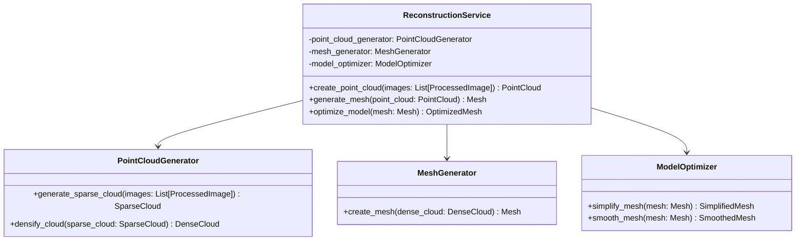

# 3D Reconstruction Service

## Overview

The 3D Reconstruction Service is responsible for creating 3D models from the processed images. It uses photogrammetry techniques to generate point clouds, create meshes, and optimize the resulting 3D models.

## Class Diagram

## Key Components

1. **ReconstructionService**: The main class that coordinates the 3D reconstruction process.
2. **PointCloudGenerator**: Generates point clouds from processed images.
3. **MeshGenerator**: Creates a mesh from the point cloud.
4. **ModelOptimizer**: Optimizes the generated 3D model.

## How It Works

1. `create_point_cloud()` is called with the processed images. It uses the PointCloudGenerator to create a sparse point cloud and then densify it.
2. `generate_mesh()` takes the dense point cloud and creates a mesh using the MeshGenerator.
3. `optimize_model()` is called to simplify and smooth the mesh, improving its quality and reducing file size.

## Technologies Used

- COLMAP: For Structure from Motion (SfM) and Multi-View Stereo (MVS)
- Open3D: For point cloud and mesh processing
- NumPy: For numerical operations

## Key Steps in 3D Reconstruction

1. Camera calibration: Determines the position and orientation of each camera (image)
2. Sparse reconstruction: Creates an initial sparse point cloud
3. Dense reconstruction: Generates a dense point cloud from the sparse reconstruction
4. Mesh generation: Creates a 3D mesh from the dense point cloud
5. Mesh optimization: Simplifies and smooths the mesh for better quality and smaller file size

## Output

The service outputs an optimized 3D mesh, which can be used by the Upholstery Service for pattern calculation and by the Visualization Service for rendering and creating Gaussian Splat reconstructions.