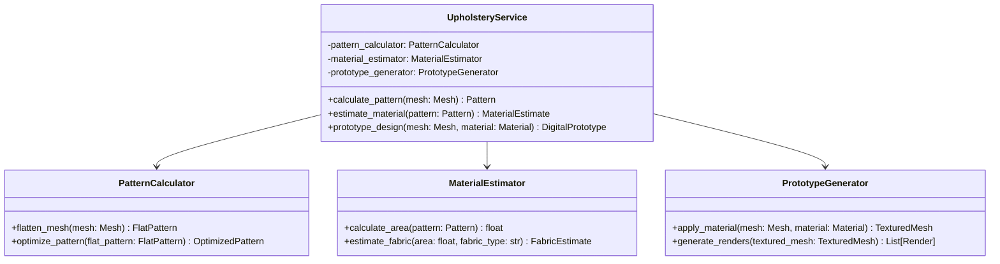

# Upholstery Service

## Overview

The Upholstery Service is responsible for calculating patterns from 3D models and creating digital prototypes for reupholstery projects. It's a key component that sets StitchSketch apart from general-purpose photogrammetry software.

## Class Diagram

## Key Components

1. **UpholsteryService**: The main class that coordinates upholstery-related tasks.
2. **PatternCalculator**: Calculates 2D patterns from 3D meshes.
3. **MaterialEstimator**: Estimates material requirements based on calculated patterns.
4. **PrototypeGenerator**: Creates digital prototypes of reupholstered furniture.

## How It Works

1. `calculate_pattern()` is called with a 3D mesh. It uses the PatternCalculator to flatten the 3D mesh into a 2D pattern and then optimize it.
2. `estimate_material()` takes the calculated pattern and uses the MaterialEstimator to determine the amount of fabric needed.
3. `prototype_design()` is called with a 3D mesh and material information. It uses the PrototypeGenerator to apply the material to the mesh and generate renders of the reupholstered furniture.

## Technologies Used

- NumPy and SciPy: For numerical operations and optimization
- Open3D: For mesh manipulation
- Custom algorithms: For mesh flattening and pattern optimization
- Blender (via Python API): For generating high-quality renders of digital prototypes

## Key Features

1. Pattern Calculation:
   - Mesh flattening: Converts 3D surfaces into 2D patterns
   - Pattern optimization: Minimizes fabric waste and ensures proper fit
2. Material Estimation:
   - Area calculation: Determines the total fabric area needed
   - Fabric type consideration: Adjusts estimates based on fabric properties (stretch, thickness, etc.)
3. Digital Prototyping:
   - Material application: Simulates the appearance of different fabrics on the 3D model
   - Render generation: Creates realistic visualizations of the reupholstered furniture

## Output

The service outputs 2D patterns for cutting fabric, material estimates for ordering supplies, and digital prototypes for client approval and marketing purposes.