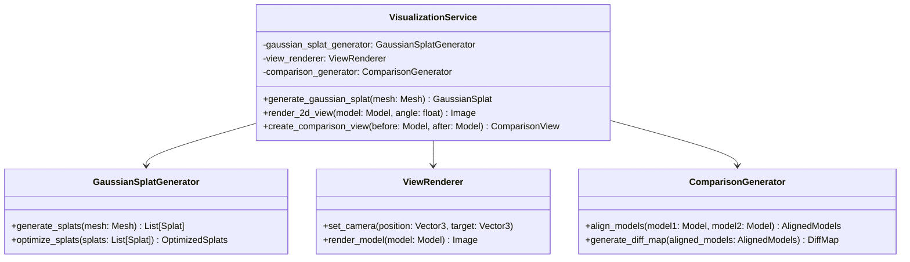

# Visualization Service

## Overview

The Visualization Service is responsible for generating various visual representations of the 3D models, including Gaussian Splat reconstructions, 2D renders, and comparison views. These visualizations are crucial for client presentations and marketing materials.

## Class Diagram

## Key Components

1. **VisualizationService**: The main class that coordinates visualization tasks.
2. **GaussianSplatGenerator**: Creates Gaussian Splat representations of 3D models.
3. **ViewRenderer**: Generates 2D renders of 3D models from specified angles.
4. **ComparisonGenerator**: Creates visual comparisons between before and after models.

## How It Works

1. `generate_gaussian_splat()` is called with a 3D mesh. It uses the GaussianSplatGenerator to create a Gaussian Splat representation, which is optimized for efficient rendering.
2. `render_2d_view()` takes a 3D model and an angle, using the ViewRenderer to create a 2D image from that perspective.
3. `create_comparison_view()` is called with before and after 3D models. It uses the ComparisonGenerator to align the models and create a visual representation of the differences.

## Technologies Used

- Open3D: For 3D model manipulation and rendering
- Custom Gaussian Splat algorithm: For creating efficient, high-quality splat-based representations
- NumPy: For numerical operations
- Pillow or OpenCV: For image processing and 2D rendering

## Key Features

1. Gaussian Splat Generation:
   - Converts mesh models to splat-based representations
   - Optimizes splats for efficient rendering and high visual quality
2. 2D View Rendering:
   - Generates high-quality 2D renders from any angle
   - Supports various lighting conditions and materials
3. Comparison View Creation:
   - Aligns before and after models
   - Generates visual diff maps to highlight changes
   - Supports side-by-side and overlay comparison modes

## Output

The service outputs various visual representations:
- Gaussian Splat models for efficient web-based 3D viewing
- 2D renders for traditional presentations and marketing materials
- Comparison views to showcase the impact of reupholstery projects

These visualizations can be used in the web interface, exported for client presentations, or used in marketing materials to showcase StitchSketch's capabilities.