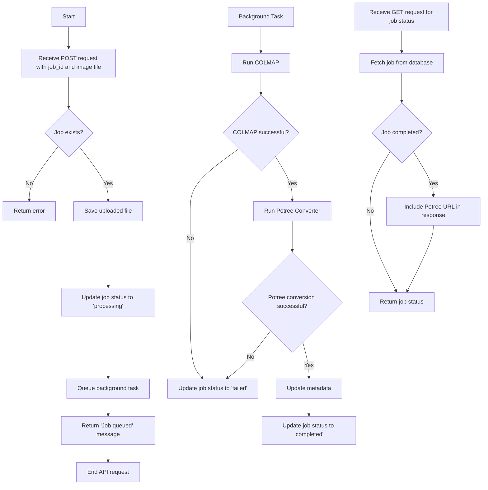

# StitchSketch Pointcloud Processing Microservice

This microservice is part of a larger system for processing images/video into 3D pointclouds and rendering them as web assets. It handles the image processing pipeline using COLMAP for 3D reconstruction and Potree for converting the resulting pointcloud into a usable 3D model.

## Functionality

This container provides two main endpoints:

1. POST `/process/{job_id}`: Initiates the processing of uploaded images for a given job.
2. GET `/job/{job_id}`: Retrieves the status of a job, including the URL of the processed Potree model when complete.

### Control Flow

The following diagram illustrates the control flow of the image processing pipeline:



## Key Components

1. **FastAPI Application**: Handles HTTP requests and responses.
2. **SQLAlchemy**: Manages database operations for job tracking.
3. **COLMAP**: Performs 3D reconstruction from input images.
4. **Potree Converter**: Converts the COLMAP output into a web-friendly 3D model format.
5. **Background Tasks**: Processes jobs asynchronously to prevent API timeout.

## File Structure

```shell
project_root/
├── app/
│   ├── __init__.py
│   ├── main.py
│   ├── models.py
│   ├── processing.py
│   └── database.py
├── data/
│   ├── raw/
│   ├── processed/
│   └── potree/
├── requirements.txt
└── .env
```

## Setup and Running

This is all part of a much larger project, please don't try to get this one container running on its own without the others, it probably won't work lol

## API Endpoints

### POST `/process/{job_id}`

Initiates the processing of a new job.

- **Parameters**:
  - `job_id` (path): Unique identifier for the job
  - `file` (form-data): Image file to process

- **Response**:
  - 200 OK: `{"message": "Job queued for processing"}`
  - 404 Not Found: `{"error": "Job not found"}`

### GET /job/{job_id}

Retrieves the status of a job.

- **Parameters**:
  - `job_id` (path): Unique identifier for the job

- **Response**:
  - 200 OK: `{"id": "job_id", "status": "completed", "potree_url": "http://example.com/potree/job_id"}`
  - 404 Not Found: `{"error": "Job not found"}`
